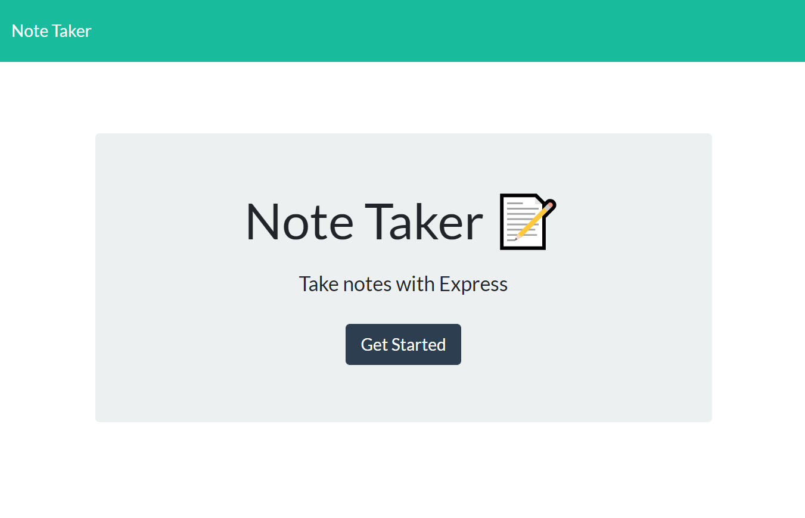

# notation
Create, store and modify notable notes, in the cloud.

  

## Table of Contents
- [notation](#notation)
- [Description](#description)
- [Installation](#installation)
- [Usage](#usage)
- [Licence](#licence)
- [Contributing](#contributing)
- [Questions](#questions)

## Description



This Heroku-hosted app allows a user to create, store and modify notes, in the cloud

[GitHub Repo](https://www.github.com/brhestir/notation)

[Deployed Heroku Instance](https://limitless-savannah-86844.herokuapp.com/)

## Installation
```bash
npm install
```

## Usage
```bash
npm start
```

## Licence


## Contributing
Contributions welcome!

## Questions
Questions are welcome, contact me on GitHub or in the comments.